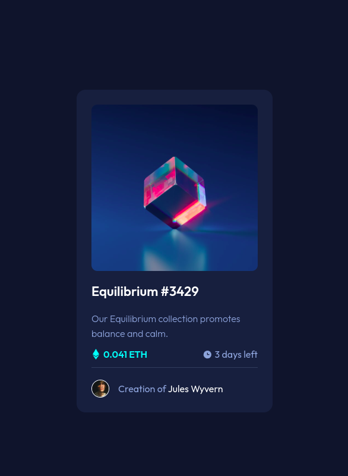
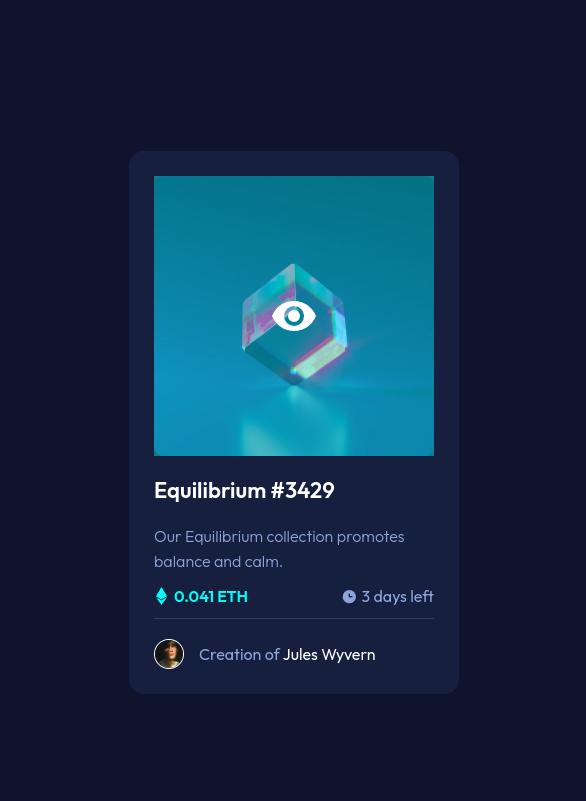

# NFT preview card component - Frontend Mentor

## Índice

- [NFT preview card component - Frontend Mentor](#nft-preview-card-component---frontend-mentor)
  - [Índice](#índice)
  - [Sobre](#sobre)
  - [Tecnologias](#tecnologias)
  - [Pré-visualização card](#pré-visualização-card)
  - [Pré-visualização card selicionado](#pré-visualização-card-selicionado)
  - [Autor](#autor)

## Sobre

Nesse projeto foi bem desafiador centralizar os elementos, mais no fínal deu tudo certo, para frente e avante!

## Tecnologias

- HTML
- CSS

## Pré-visualização card

## Pré-visualização card selicionado

## Autor

- Guithub - [Wagnerpx](https://github.com/wagnerpx)
- Fronted Mentor - [@Wagnerpx](https://www.frontendmentor.io/profile/wagnerpx)
- LinkedIn - [Wagner Alexandre](https://www.linkedin.com/in/wagnerpx/)